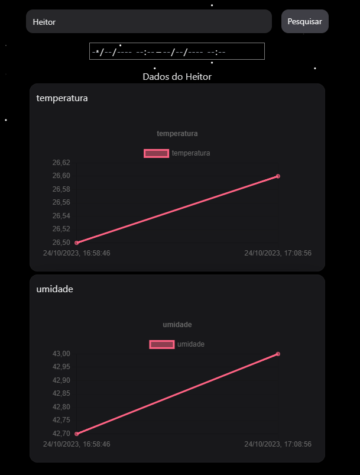

# Instruções iniciais

### Seja bem vindo a wiki do [Monitor](https://github.com/freecorps/monitor), um fork do [Meteoro](https://github.com/freecorps/meteoro) feito especialmente para a aula de Computação e Automação da FACAMP ministrada pelo professor Bruno Moser.

Nessa Wiki você vai aprender de maneira fácil a como configurar seu proprio ESP com seus sensores e como monitorar as leituras pelo nosso [site](https://monitor.freecorps.xyz/).

O resultado final do projeto pode ser verificado pelo site colocando o id `Heitor` no campo de texto e clicando em `Pesquisar`.

&#x20;

Se feito corretamente o resultado final sera algo parecido com isso.

Para começar esse tutorial vá primeiramente para a  [como-colocar-os-sensores.md](../esp/como-colocar-os-sensores.md "mention")  e coloque de maneira correta o sensor no seu ESP/Arduino.
