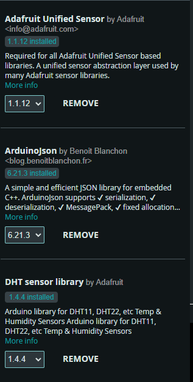

# Código do ESP

Vamos lá! Vou explicar esse código por partes, de forma bem didática e, depois, detalharei como testar cada seção. (o código completo pode ser encontrado no final da página)

#### 1. Bibliotecas:

```arduino
#include <ESP8266WiFi.h>
#include <DHT.h>
#include <ArduinoJson.h>
```



Essas são as bibliotecas necessárias:

* `ESP8266WiFi.h`: para conectar o módulo ESP8266 à rede Wi-Fi.
* `DHT.h`: para interagir com o sensor DHT11.
* `ArduinoJson.h`: para criar e manipular dados no formato JSON.

#### 2. Configurações:

```arduino
const char* ssid = "nome do seu Wi-Fi";
const char* password = "Senha do seu Wi-Fi";
const int DHTPin = D1;
DHT dht(DHTPin, DHT11);
const char* serverUrl = "monitor.freecorps.xyz";
const int serverPort = 443;
const char* IdDoESP = "ID DO SEU ESP";
const char* key = "CHAVE SECRETA";
WiFiClientSecure client;
```

Aqui são definidos os parâmetros:

* `ssid` e `password`: são as credenciais da rede Wi-Fi.
* `DHTPin`: pino onde o sensor DHT11 está conectado.
* `serverUrl`, `serverPort`, `IdDoESP`, `key`: são detalhes para a conexão e autenticação com o servidor.

O que você precisa mudar é:

* Seus dados de conexão Wi-Fi
* O ID do seu ESP (deve ser único para cada pessoa)
* Chave secreta (Essa chave vai ser verificada em cada chamada para o servidor para evitar que outra pessoa mude os seus dados, lembre-se dessa chave e a guarde em um lugar seguro)

#### 3. Configuração Inicial (setup):

```arduino
void setup() {
  Serial.begin(115200);
  dht.begin();
  WiFi.begin(ssid, password);
  while (WiFi.status() != WL_CONNECTED) {
    delay(1000);
    Serial.println("Conectando ao WiFi...");
  }
  Serial.println("Conectado ao WiFi");
}
```

Nessa seção:

* Inicializamos a comunicação serial.
* Começamos a comunicação com o sensor DHT11.
* Tentamos conectar à rede Wi-Fi e aguardamos até que a conexão seja estabelecida.

#### 4. Loop Principal:

Dentro da função `loop()`:

* Leituras da temperatura e umidade são feitas.
* Se as leituras são inválidas, retorna uma mensagem de erro.
* Os dados lidos são formatados em um JSON.
* Uma conexão é estabelecida com o servidor e os dados são enviados via POST.
* O código aguarda uma resposta do servidor e a imprime no monitor serial.
* O loop aguarda 10 minutos (`delay(600000)`) antes de reiniciar.

#### Como Testar:

**1. Verificação da Conexão Wi-Fi:** Após carregar o código, abra o monitor serial e verifique se a mensagem "Conectado ao WiFi" é exibida.

**2. Testando o Sensor DHT11:** Coloque o dedo no sensor para aumentar a umidade e veja se as leituras no monitor serial mudam.

**3. Envio de Dados para o Servidor:** Verifique no monitor serial as respostas do servidor após o envio dos dados. Se tudo estiver certo, deve aparecer "Dados enviados com sucesso". Se houver algum problema, o erro será indicado.

**4. Servidor:** Se tudo deu certo seu ESP já pode ser visualizado no nosso [site](https://monitor.freecorps.xyz/).

**5. Função de Delay:** Após os dados serem enviados, você deve esperar 10 minutos antes de enviar os dados novamente. Isso é importante para não sobrecarregar o servidor.


## código completo:

```arduino
#include <ESP8266WiFi.h>
#include <DHT.h>
#include <ArduinoJson.h>

// Configurações do WiFi
const char* ssid = "nome do seu Wi-Fi";
const char* password = "Senha do seu Wi-Fi";

// Configurações do DHT11
const int DHTPin = D1;  // O pino GPIO que o sensor DHT11 está conectado
DHT dht(DHTPin, DHT11);

// Configurações
const char* serverUrl = "monitor.freecorps.xyz";
const int serverPort = 443;
const char* IdDoESP = "ID DO SEU ESP";
const char* key = "CHAVE SECRETA";

WiFiClientSecure client;

void setup() {
  Serial.begin(115200);
  dht.begin();

  // Conectar ao WiFi
  WiFi.begin(ssid, password);
  while (WiFi.status() != WL_CONNECTED) {
    delay(1000);
    Serial.println("Conectando ao WiFi...");
  }
  Serial.println("Conectado ao WiFi");
}

void loop() {
  // Medir temperatura e umidade
  float temperatura = dht.readTemperature();
  float umidade = dht.readHumidity();

  // Verificar se as leituras são válidas
  if (isnan(temperatura) || isnan(umidade)) {
    Serial.println("Erro ao ler o sensor DHT11");
    return;
  }

  // Criar o JSON com os dados
  StaticJsonDocument<300> doc;
  doc["IdDoESP"] = IdDoESP;
  doc["key"] = key;
  JsonObject readings = doc.createNestedObject("readings");
  readings["temperatura"] = temperatura;
  readings["umidade"] = umidade;
  String json;
  serializeJson(doc, json);

  // Enviar os dados para o servidor
client.setInsecure();
if (client.connect(serverUrl, serverPort)) {
  // Enviar requisição POST com os dados
  client.print("POST /api/postInfo HTTP/1.1\r\n");
  client.print("Host: ");
  client.print(serverUrl);
  client.print("\r\n");
  client.print("Content-Length: ");
  client.print(json.length());
  client.print("\r\n");
  client.print("Content-Type: application/json\r\n");
  client.print("\r\n");
  client.print(json);
  client.print("\r\n");

  // Aguarde até que o cliente tenha disponível os dados para ler
  while (client.connected() && !client.available()) {
    delay(1);
  }

  // Ler e imprimir a resposta do servidor
  Serial.println("Resposta do servidor:");
  while (client.available()) {
    String line = client.readStringUntil('\r');
    Serial.print(line);
  }
  client.stop();
  Serial.println("\nDados enviados com sucesso");
} else {
  Serial.println("Erro ao conectar ao servidor");
}


  // Aguarde 10 minutos antes de enviar os dados novamente
  delay(600000);
}

```
